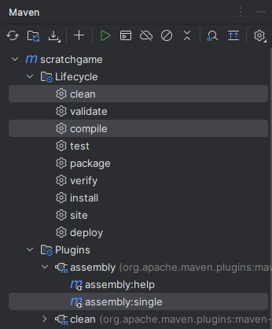
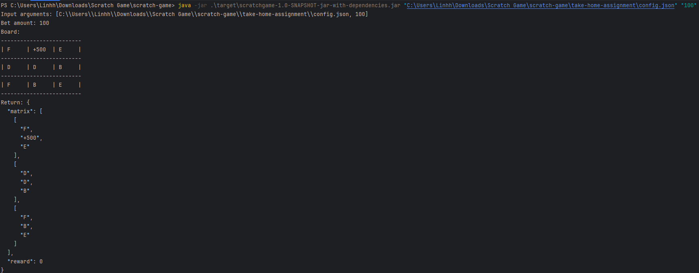
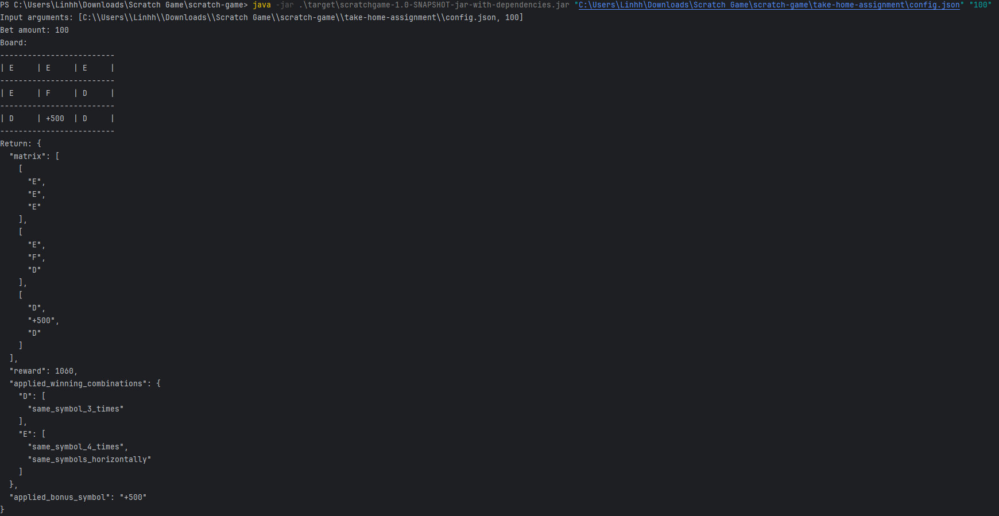

# Scratch Game #
## Requirements ##
- JDK 11
- Maven
- IntelliJ IDEA
## Build Jar File ##
- Using IntelliJ IDEA: Run with these three options selected

- Using CMD: Run this command
```bash
mvn clean compile assembly:single
```
## Run Jar File ##
```bash
java -jar <path-to-jar-file> <path-to-json-config-file> <betting-amount(optional)>
```
## Examples ##
- Lost game:

- Won game:
